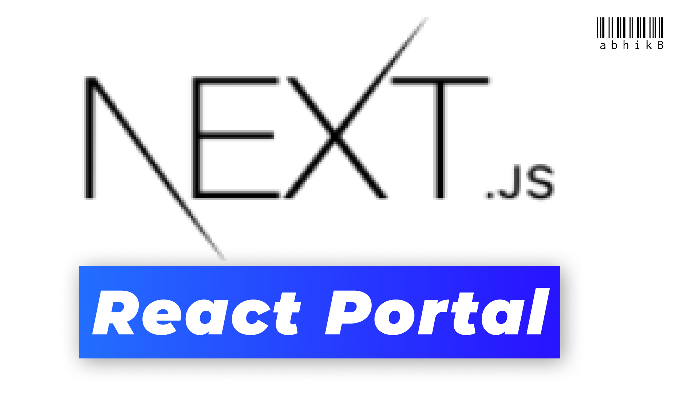

## This is a  small tutorial on creating portals with [Next.js](https://nextjs.org/), so this repo will serve as the codebase. [Watch the video ](https://youtu.be/xaiE_K32gBE)!!

---

## Getting Started

1. Create a `_document.js` in pages directory
2. Import and create a  new component which extends `Document`  then render the necessary stuff
3. Then below `Main` and  above `Nextscript` create a custom div with id
4. Then create a custom  component and then `createPortal` with   children elements and `DOM Node`    if the component is mounted
5. Then render this custom component in the desired pages in desired way ✌

---
## Learn More

Read the article about Tooltip: https://blog.logrocket.com/learn-react-portals-by-example/

Check the code sandbox : https://codesandbox.io/s/github/supromikali/react-portals-example?file=/src/TooltipPopover.js

To learn more about Next.js, take a look at the following resources:

- [Next.js Documentation](https://nextjs.org/docs) - learn about Next.js features and API.
- [Learn Next.js](https://nextjs.org/learn) - an interactive Next.js tutorial.

You can check out [the Next.js GitHub repository](https://github.com/vercel/next.js/) - your feedback and contributions are welcome!

